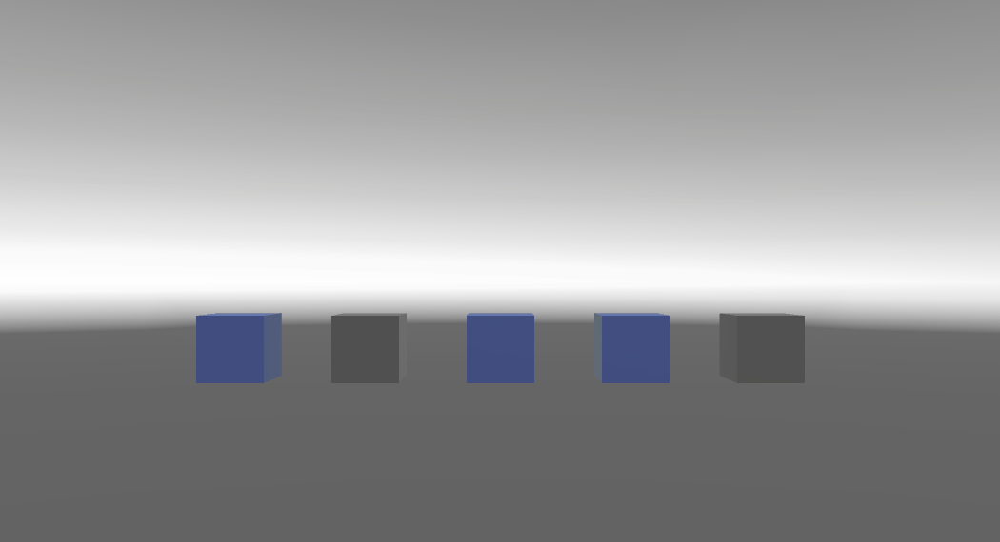
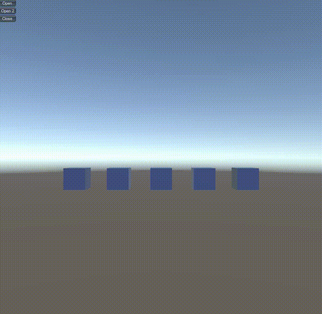

  
URP下灰度化背景，高亮指定物体  
# 使用
使用示例可参考包内Runtime/Scenes路径的示例场景  
```
//接口1

/// <summary>
/// 模式1
/// </summary>
/// <param name="gameObjects">需要高亮物体的数组</param>
/// <param name="duration">持续时间</param>
public static void Open(GameObject[] gameObjects, float duration = 1);

//接口2

/// <summary>
/// 模式2
/// </summary>
/// <param name="gameObjects">需要高亮物体的数组</param>
/// <param name="positionWS">扩散效果起始的位置（世界坐标）</param>
/// <param name="duration">持续时间</param>
public static void Open(GameObject[] gameObjects, Vector3 positionWS, float duration = 1);
```  
**灰度化背景有两种模式**  
模式1：  
  
模式1下由彩色渐变为灰度  
此模式使用接口1，传入需要高亮物体的数组，持续时间为可选  

模式2：  
  
模式2下从指定的位置开始，灰度逐渐扩散至整个视野  
此模式使用接口2，传入需要高亮物体的数组，并传入高亮的起始位置，例如需要高亮物体的位置，持续时间可选  

Demo Script：  
```
void OnGUI()
{
    if (GUILayout.Button("Open"))
    {
        GBHighlight.Open(gameObjects, duration);
    }
    if (GUILayout.Button("Open 2"))
    {
        GBHighlight.Open(gameObjects, gameObjects[Mathf.Min(index, gameObjects.Length - 1)].transform.position, duration);
    }
    if (GUILayout.Button("Close"))
    {
        GBHighlight.Close();
    }
}
```