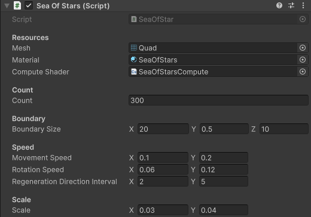

# Preview

# 使用
  

**Resources**  
Mesh：需要绘制的网格  
Material：绘制网格用到的材质，材质必须使用包内Runtime/Shaders路径下的FallenLeaves.shader  
Compute Shader：计算落叶用到的Compute Shader，需使用包内位于Runtime/Resource/Shaders路径下的SeaOfStarsCompute.compute  

**Count**  
Count：粒子的数量  

**Boundary**  
Boundary Size：粒子边界的范围，以脚本所在物体位置为中心边界为长宽高的盒子范围  

**Speed**  
Movement Speed：粒子移动的速度  
Rotation Speed：粒子转向的速度  
Regeneration Direction Interval：重新生成粒子移动方向的间隔时间  

**Scale**  
Scale：粒子的缩放  